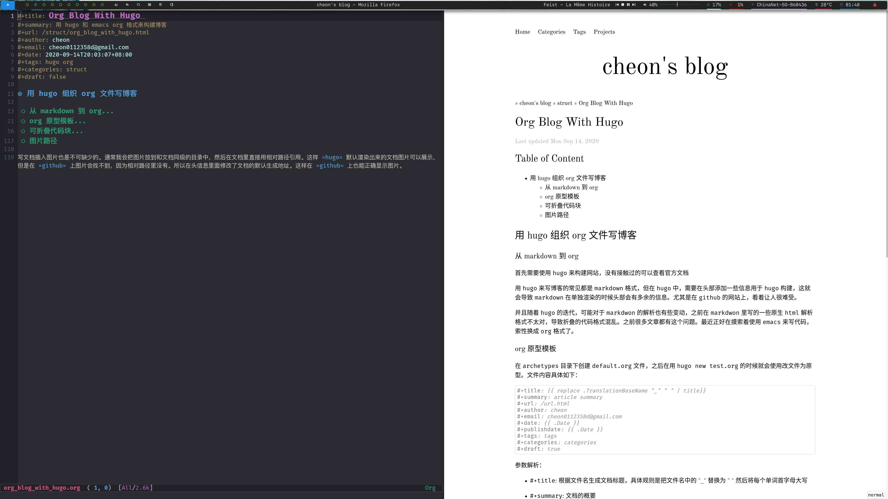

#+title: Org Blog With Hugo
#+summary: 用 hugo 和 emacs org 格式来构建博客
#+url: /struct/org_blog_with_hugo.html
#+author: cheon
#+email: cheon0112358d@gmail.com
#+date: 2020-09-14T20:03:07+08:00
#+tags: hugo org
#+categories: struct
#+draft: false

* 用 hugo 组织 org 文件写博客

** 从 markdown 到 org

首先需要使用 =hugo= 来构建网站，没有接触过的可以查看[[https://gohugo.io/getting-started/quick-start/][官方文档]]

用 =hugo= 来写博客的常见都是 =markdown= 格式，但在 =hugo= 中，需要在头部添加一些信息用于 =hugo= 构建，这就会导致 =markdown= 在单独渲染的时候头部会有多余的信息。尤其是在 =github= 的网站上，看着让人很难受。

并且随着 =hugo= 的迭代，可能对于 =markdwon= 的解析也有些变动，之前在 =markdwon= 里写的一些原生 =html= 解析格式不太对，导致折叠的代码格式混乱。之前很多文章都有这个问题。最近正好在摸索着使用 =emacs= 来写代码，索性换成 =org= 格式了。

** org 原型模板

在 =archetypes= 目录下创建 =default.org= 文件，之后在用 =hugo new test.org= 的时候就会使用改文件为原型。文件内容具体如下：

#+begin_src org
#+title: {{ replace .TranslationBaseName "_" " " | title}}
#+summary: article summary
#+url: /url.html
#+author: cheon
#+email: cheon0112358d@gmail.com
#+date: {{ .Date }}
#+publishdate: {{ .Date }}
#+tags: tags
#+categories: categories
#+draft: true
#+end_src

参数解析：
- =#+title=: 根据文件名生成文档标题，具体规则是把文件名中的 "_" 替换为 " " 然后将每个单词首字母大写
- =#+summary=: 文档的概要
- =#+url=: 指定文档生成的 =url=
- =+tags=: 文档的标签
- =+categories=: 文档的类别
- =+draft=: 是否是草稿，草稿在构建时默认不会渲染成 =html=

注意在 =hugo= 构建或者运行时，可能会看到

#+begin_quote
=Please use '#+tags[]:' notation, automatic conversion is deprecated.=

=Please use '#+categories[]:' notation, automatic conversion is deprecated.=
#+end_quote

类似警告，可以忽略，不影响文档的渲染。如果照提示修改，反而会导致 =org= 文件在 github 网站上头部信息显示异常。

** 可折叠代码块

写文档的时候一个常用的功能是代码块，当代码太长的时候需要可以折叠。这个在 =org= 中可以用原生 =html= 的 =<detail>= 标签来实现。

#+begin_export html

可折叠代码块实现

#+end_export

#+begin_example org
#+begin_export html

summary

#+end_export

#+begin_src
在这里写代码
#+end_src

#+begin_export html

#+end_export
#+end_example

#+begin_export html

#+end_export

但是每次写这么一大堆也比较麻烦，所以可以用 =yasnippet= 来管理片段。在 =emacs= 中按下 =M-x= 执行 =yas-new-snippet= 并填入一下内容

#+begin_export html

code

#+end_export

#+begin_example
# -*- mode: snippet -*-
# name: org mode collapsable code block
# key: code
# --

#+begin_export html

$1

#+end_export

#+begin_src $2
$3
#+end_src

#+begin_export html

#+end_export
#+end_example

#+begin_export html

#+end_export

将文件保存到 =org-mode/code= 文件，以后在写 =org= 文档时，只要输入 =code= 再按下 =tab= 键就会生成这段代码

** 图片路径

写文档插入图片也是不可缺少的。通常我会把图片放到和文档同级的目录中，然后在文档里直接用相对路径引用。这样 =hugo= 默认渲染出来的文档图片可以展示，但是在 =github= 上图片会找不到，因为相对路径里没有。所以在头信息里面修改了文档的默认生成地址。这样在 =github= 上也能正确显示图片。

图片测试：

